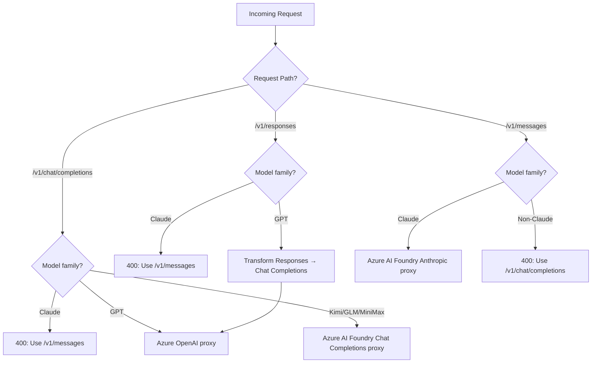
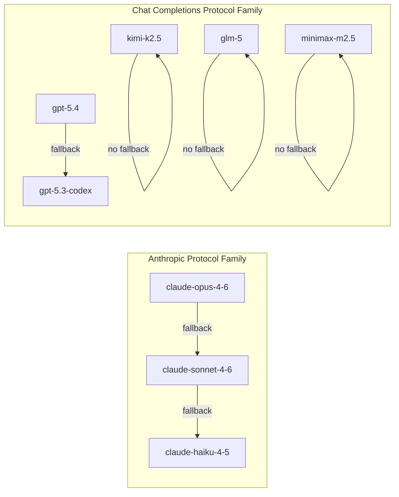
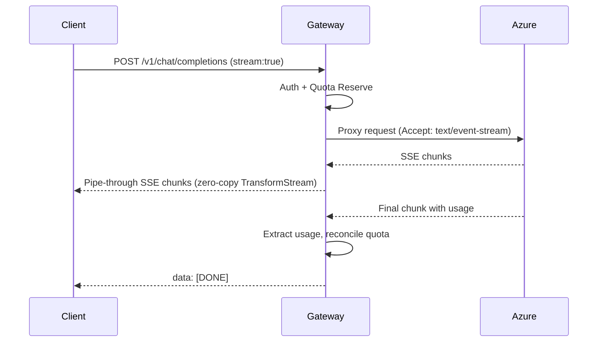
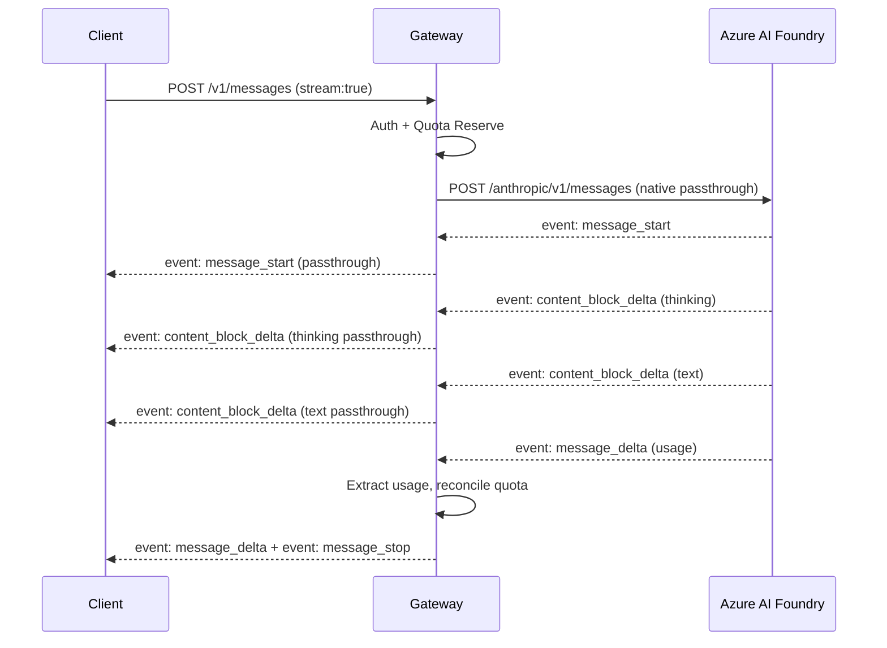

# Design Document

## Overview

The LLM Gateway is a Bun + Hono application that proxies LLM requests to Azure backends through two distinct, non-translating protocol paths:

- **OpenAI path**: `/v1/chat/completions` and `/v1/responses` → Azure OpenAI (GPT) and Azure AI Foundry Model Inference API (Kimi, GLM, MiniMax)
- **Anthropic path**: `/v1/messages` → Azure AI Foundry Anthropic API (Claude) at the native `anthropic/v1/messages` endpoint

Cross-cutting concerns (PAT auth, quota, rate limiting, observability) are handled by shared Hono middleware before requests fan out to protocol-specific proxy handlers. There is no protocol translation between the two paths — Claude models reject Chat Completions requests and vice versa.

#[[file:docs/llm-gateway-prd.md]]
#[[file:.context/specs/llm-gateway/requirements.md]]

## Architecture

### High-Level Request Flow

```mermaid
flowchart TD
    Client[Developer CLI / SDK] -->|HTTPS + PAT| GW[Gateway - Hono on Bun]

    subgraph "Shared Middleware Pipeline"
        A[PAT Auth] --> B[Rate Limiter]
        B --> C[Protocol Router]
        C --> D[Model Resolver]
        D --> E[Quota Reservation]
    end

    GW --> A

    E -->|model ∈ GPT family| OAI[OpenAI Chat Completions Proxy]
    E -->|model ∈ Kimi/GLM/MiniMax| FW_CC[Foundry Chat Completions Proxy]
    E -->|model ∈ Claude family| ANT[Anthropic Messages Proxy]
    E -->|Responses API| RESP[Responses → Chat Completions Transform + Proxy]

    OAI -->|POST /openai/deployments/{name}/chat/completions| AzureOpenAI[Azure OpenAI]
    FW_CC -->|POST /models/chat/completions| AzureFoundryCC[Azure AI Foundry - OpenAI compat]
    ANT -->|POST /anthropic/v1/messages| AzureFoundryAnt[Azure AI Foundry - Anthropic native]
    RESP --> OAI

    AzureOpenAI -->|SSE / JSON| ReconcileA[Quota Reconcile + Log]
    AzureFoundryCC -->|SSE / JSON| ReconcileB[Quota Reconcile + Log]
    AzureFoundryAnt -->|SSE / JSON| ReconcileC[Quota Reconcile + Log]

    ReconcileA --> Client
    ReconcileB --> Client
    ReconcileC --> Client
```

### Protocol Routing Decision



### Fallback Chains (Same-Protocol Only)



## Components and Interfaces

### Project Structure

```
llm-gateway/
├── src/
│   ├── index.ts                    # Hono app bootstrap, export default
│   ├── config/
│   │   ├── env.ts                  # Zod-validated environment config
│   │   ├── deployments.ts          # Azure deployment registry + model families
│   │   └── pricing.json            # Hot-reloadable cost rates
│   ├── middleware/
│   │   ├── auth.ts                 # PAT verification + revocation check
│   │   ├── rate-limit.ts           # Per-user RPM/TPM via Redis
│   │   ├── quota.ts                # Reservation-based quota enforcement
│   │   ├── request-id.ts           # X-Request-Id generation + propagation
│   │   └── protocol-guard.ts       # Model-to-protocol validation (reject mismatches)
│   ├── proxy/
│   │   ├── openai-chat.proxy.ts    # Proxy handler for /v1/chat/completions
│   │   ├── openai-responses.proxy.ts # Transform + proxy for /v1/responses
│   │   └── anthropic.proxy.ts      # Passthrough proxy for /v1/messages
│   ├── services/
│   │   ├── azure-auth.ts           # Entra ID token manager + API key resolver
│   │   ├── quota.service.ts        # Redis Lua-based reservation lifecycle
│   │   ├── pricing.service.ts      # decimal.js cost calculation + hot-reload
│   │   ├── circuit-breaker.ts      # Per-deployment circuit breaker state machine
│   │   ├── retry.ts                # Exponential backoff with jitter + Retry-After
│   │   └── health.service.ts       # Periodic health checks per deployment
│   ├── routes/
│   │   ├── chat.routes.ts          # /v1/chat/completions
│   │   ├── responses.routes.ts     # /v1/responses
│   │   ├── messages.routes.ts      # /v1/messages
│   │   ├── models.routes.ts        # /v1/models
│   │   ├── health.routes.ts        # /health, /ready
│   │   ├── quota.routes.ts         # /quota
│   │   └── admin.routes.ts         # /admin/pat/revoke
│   ├── utils/
│   │   ├── tokens.ts               # tiktoken estimation + fallback
│   │   ├── streaming.ts            # SSE parser, pipe-through transforms
│   │   └── errors.ts               # Protocol-aware error factories
│   └── observability/
│       ├── tracing.ts              # OpenTelemetry SDK init + custom spans
│       ├── metrics.ts              # Prometheus-style metrics
│       └── logger.ts               # Structured JSON logger (pino)
├── http/
│   ├── chat-completions.http       # Chat Completions test requests
│   ├── responses.http              # Responses API test requests
│   ├── messages.http               # Anthropic Messages API test requests
│   ├── models.http                 # Model listing test requests
│   ├── health.http                 # Health + readiness checks
│   ├── quota.http                  # Quota status test requests
│   ├── admin.http                  # Admin API test requests
│   └── http-client.env.json        # Environment variables for HTTP client
├── tests/
│   ├── unit/                       # Pure function tests (pricing, tokens, errors)
│   ├── integration/                # Full request cycle with mocked Azure
│   └── fixtures/                   # Sample request/response payloads
├── docker-compose.yml
├── Dockerfile
├── package.json
└── tsconfig.json
```

### Core Interfaces

```typescript
// === Model Family & Deployment Registry ===

type ModelFamily = "gpt" | "claude" | "kimi" | "glm" | "minimax";
type ProtocolFamily = "chat-completions" | "anthropic-messages";

interface DeploymentConfig {
  name: string;                          // e.g. "gpt-5.4-global"
  modelAlias: string;                    // e.g. "gpt-5.4"
  modelFamily: ModelFamily;
  protocolFamily: ProtocolFamily;
  azureModelName: string;                // e.g. "gpt-5.4", "FW-Kimi-K2.5"
  endpoint: string;                      // Azure base URL
  authConfig: AzureAuthConfig;
  apiVersion: string;
  fallbackDeployment?: string;           // Must be same protocolFamily
  enabled: boolean;
}

// === Azure Auth ===

type AzureAuthType = "entra-id" | "api-key";

interface AzureAuthConfig {
  type: AzureAuthType;
  // Entra ID
  tenantId?: string;
  clientId?: string;
  clientSecret?: string;
  scope?: string;
  // API Key
  apiKey?: string;
  keyHeader?: "api-key" | "x-api-key" | "Authorization";
}

// === Request Metadata Envelope ===
// This wraps any protocol-specific body with cross-cutting metadata.
// The original request body is NOT transformed between protocols.

interface RequestEnvelope {
  requestId: string;
  userId: string;
  scope: string;
  deployment: DeploymentConfig;
  protocolFamily: ProtocolFamily;
  reservationId: string;
  estimatedCost: Decimal;
  thinkingEnabled: boolean;
  startTime: number;
  originalBody: unknown;              // Raw request body, untouched
}

// === Quota ===

interface QuotaReservation {
  allowed: boolean;
  reservationId?: string;
  estimatedCost?: Decimal;
  reason?: string;
}

interface QuotaStatus {
  monthly_budget_usd: number;
  spent_usd: number;
  reserved_usd: number;
  remaining_usd: number;
  reset_date: string;
}

// === Pricing ===

interface ModelPricing {
  deploymentPattern: string;
  inputPerMillion: Decimal;
  outputPerMillion: Decimal;
  thinkingPerMillion?: Decimal;
  cacheWritePerMillion?: Decimal;
  cacheReadPerMillion?: Decimal;
}

// === Usage (from Azure response) ===

interface TokenUsage {
  prompt_tokens: number;
  completion_tokens: number;
  thinking_tokens?: number;
  cache_creation_input_tokens?: number;
  cache_read_input_tokens?: number;
}
```

### Component Interaction Detail

#### 1. PAT Auth Middleware (`middleware/auth.ts`)

- Extracts `Authorization: Bearer {token}` header
- Parses token format: `lg_{userId}_{base64header}.{base64payload}.{signature}`
- Verifies HMAC-SHA256 signature against `PAT_SECRET`
- Checks Redis blocklist: `GET blocklist:pat:{jti}` — if present, return 401
- Checks `exp` claim — if expired, return 401
- Sets `c.set("userId", ...)`, `c.set("scope", ...)`, `c.set("jti", ...)` on Hono context

#### 2. Protocol Guard Middleware (`middleware/protocol-guard.ts`)

After model resolution, validates the request path matches the model's protocol family:

| Request Path             | Allowed Model Families       | Rejection Message                                     |
|--------------------------|------------------------------|-------------------------------------------------------|
| `/v1/chat/completions`   | gpt, kimi, glm, minimax     | "Claude models are only available via POST /v1/messages" |
| `/v1/responses`          | gpt                          | "This endpoint only supports GPT models"              |
| `/v1/messages`           | claude                       | "Non-Claude models are only available via POST /v1/chat/completions" |

#### 3. Proxy Handlers

**OpenAI Chat Completions Proxy** (`proxy/openai-chat.proxy.ts`):
- Receives the validated request body
- Resolves deployment (Azure OpenAI for GPT, Azure AI Foundry for Kimi/GLM/MiniMax)
- Builds upstream URL:
  - GPT: `{endpoint}/openai/deployments/{deploymentName}/chat/completions?api-version={version}`
  - Kimi/GLM/MiniMax: `{endpoint}/models/chat/completions?api-version={version}` with `model` field in body set to `azureModelName`
- Gets auth headers via `AzureAuthManager`
- Proxies request with circuit breaker + retry
- For streaming: pipes response through `TransformStream` that extracts `usage` from final chunk
- On completion: reconciles quota

**Anthropic Messages Proxy** (`proxy/anthropic.proxy.ts`):
- Receives the validated Anthropic Messages request body — no transformation needed
- Builds upstream URL: `{endpoint}/anthropic/v1/messages`
- Sets required headers: `anthropic-version: 2023-06-01`, auth headers (`x-api-key` for API key, `Authorization: Bearer` for Entra ID)
- Proxies request with circuit breaker + retry
- For streaming: pipes SSE events through directly (native Anthropic format)
- Extracts `usage` from `message_stop` event for quota reconciliation
- On completion: reconciles quota

**Responses API Proxy** (`proxy/openai-responses.proxy.ts`):
- Transforms Responses API `input` field to Chat Completions `messages` array
- Transforms `tools` from Responses built-in types to function-calling format
- Delegates to the OpenAI Chat Completions proxy for the actual upstream call
- Transforms the Chat Completions response back to Responses API format

#### 4. Azure Auth Manager (`services/azure-auth.ts`)

Manages per-deployment auth with two strategies:

- **Entra ID**: OAuth2 client credentials flow → `https://login.microsoftonline.com/{tenantId}/oauth2/v2.0/token` with scope `https://cognitiveservices.azure.com/.default` (Azure OpenAI) or `https://ai.azure.com/.default` (Azure AI Foundry). Caches tokens with 5-min-before-expiry refresh.
- **API Key**: Returns static headers. For Azure OpenAI: `api-key: {key}`. For Azure AI Foundry Anthropic: `x-api-key: {key}`. For Azure AI Foundry OpenAI-compat: `api-key: {key}`.

#### 5. Circuit Breaker (`services/circuit-breaker.ts`)

State machine per deployment:
- **Closed**: Normal operation, tracks consecutive failures
- **Open**: After 5 failures, all requests go to fallback. Recheck after 30s.
- **Half-Open**: Single probe request; success → Closed, failure → Open

Fallback rules: only within same `protocolFamily`. If no fallback configured, return 503.

#### 6. Quota Service (`services/quota.service.ts`)

Redis Lua script for atomic check-and-reserve:

```
KEYS[1] = quota:{userId}:{YYYY-MM}
KEYS[2] = reserved:{userId}:{YYYY-MM}
ARGV[1] = estimatedCost
ARGV[2] = reservationId

1. budget = HGET KEYS[1] 'budget'
2. spent  = HGET KEYS[1] 'spent'
3. reserved = GET KEYS[2]
4. IF (spent + reserved + estimatedCost) > budget → REJECT
5. INCRBYFLOAT KEYS[2] estimatedCost
6. SET reservation:{reservationId} estimatedCost EX 300
7. RETURN OK
```

Reconciliation after response:
```
1. actualCost = calculate from Azure usage field
2. HINCRBYFLOAT quota:{userId}:{YYYY-MM} 'spent' actualCost
3. reservedAmount = GET reservation:{reservationId}
4. INCRBYFLOAT reserved:{userId}:{YYYY-MM} -reservedAmount
5. DEL reservation:{reservationId}
```

### Streaming Architecture



For Anthropic streaming:



The key insight: Anthropic streaming is a true passthrough — the gateway does not transform SSE event types. It only intercepts the `message_delta` event to extract token usage for billing.

## Data Models

### Redis Schema

```
# Quota tracking
quota:{user_id}:{YYYY-MM} → Hash
  ├─ budget: string (USD)
  ├─ spent: string (USD)
  └─ reset_date: string (ISO 8601)

reserved:{user_id}:{YYYY-MM} → String (total reserved USD)

reservation:{reservation_id} → String (reserved amount) [TTL: 300s]

# PAT Revocation Blocklist
blocklist:pat:{jti} → "1" [TTL: seconds until token expiry]

# Rate Limiting (sliding window)
ratelimit:rpm:{user_id} → String (request count) [TTL: 60s]
ratelimit:tpm:{user_id} → String (token count) [TTL: 60s]
```

### PostgreSQL Schema

```sql
CREATE TABLE users (
    id UUID PRIMARY KEY DEFAULT gen_random_uuid(),
    email VARCHAR(255) UNIQUE NOT NULL,
    monthly_budget_usd DECIMAL(10, 6) NOT NULL DEFAULT 50.00,
    hard_limit BOOLEAN DEFAULT true,
    rate_limit_tier VARCHAR(20) DEFAULT 'standard',
    created_at TIMESTAMPTZ DEFAULT NOW(),
    updated_at TIMESTAMPTZ DEFAULT NOW()
);

CREATE TABLE api_keys (
    id UUID PRIMARY KEY DEFAULT gen_random_uuid(),
    user_id UUID REFERENCES users(id) ON DELETE CASCADE,
    key_hash VARCHAR(255) NOT NULL,        -- HMAC hash, never raw
    prefix VARCHAR(20) NOT NULL,           -- e.g. "lg_prod_"
    scope VARCHAR(50) DEFAULT 'all',
    jti VARCHAR(255) UNIQUE NOT NULL,      -- For revocation tracking
    expires_at TIMESTAMPTZ,
    revoked_at TIMESTAMPTZ,
    revoked_reason TEXT,
    last_used_at TIMESTAMPTZ,
    created_at TIMESTAMPTZ DEFAULT NOW()
);

CREATE TABLE usage_history (
    id UUID PRIMARY KEY DEFAULT gen_random_uuid(),
    user_id UUID REFERENCES users(id),
    month VARCHAR(7) NOT NULL,             -- YYYY-MM
    total_requests INTEGER DEFAULT 0,
    total_tokens_input BIGINT DEFAULT 0,
    total_tokens_output BIGINT DEFAULT 0,
    total_tokens_thinking BIGINT DEFAULT 0,
    total_cost_usd DECIMAL(12, 6) DEFAULT 0,
    created_at TIMESTAMPTZ DEFAULT NOW(),
    UNIQUE(user_id, month)
);

CREATE TABLE request_audit (
    id UUID PRIMARY KEY DEFAULT gen_random_uuid(),
    user_id UUID REFERENCES users(id),
    request_id VARCHAR(255) NOT NULL,
    model VARCHAR(100),
    deployment VARCHAR(100),
    protocol_family VARCHAR(30),           -- 'chat-completions' | 'anthropic-messages'
    tokens_input INTEGER,
    tokens_output INTEGER,
    tokens_thinking INTEGER,
    cost_usd DECIMAL(10, 6),
    thinking_enabled BOOLEAN DEFAULT false,
    azure_auth_type VARCHAR(20),
    duration_ms INTEGER,
    status_code INTEGER,
    error_message TEXT,
    created_at TIMESTAMPTZ DEFAULT NOW()
);

CREATE TABLE pat_revocation_log (
    id UUID PRIMARY KEY DEFAULT gen_random_uuid(),
    pat_id UUID REFERENCES api_keys(id),
    revoked_by UUID REFERENCES users(id),
    revoked_at TIMESTAMPTZ DEFAULT NOW(),
    reason TEXT
);

-- Indexes for common queries
CREATE INDEX idx_request_audit_user_created ON request_audit(user_id, created_at);
CREATE INDEX idx_request_audit_model ON request_audit(model, created_at);
CREATE INDEX idx_api_keys_user ON api_keys(user_id);
CREATE INDEX idx_api_keys_jti ON api_keys(jti);
CREATE INDEX idx_usage_history_user_month ON usage_history(user_id, month);
```

### Pricing Configuration (`config/pricing.json`)

```json
{
  "version": "2026-03-15",
  "currency": "USD",
  "models": {
    "gpt-5.4": {
      "deployment_pattern": "gpt-5.4*",
      "input_per_million": 5.0,
      "output_per_million": 15.0,
      "cache_discount": 0.5
    },
    "gpt-5.3-codex": {
      "deployment_pattern": "gpt-5.3-codex*",
      "input_per_million": 4.0,
      "output_per_million": 12.0
    },
    "claude-opus-4-6": {
      "deployment_pattern": "claude-opus-4-6*",
      "input_per_million": 15.0,
      "output_per_million": 75.0,
      "cache_write_per_million": 18.75,
      "cache_read_per_million": 1.5,
      "thinking_tokens_per_million": 15.0
    },
    "claude-sonnet-4-6": {
      "deployment_pattern": "claude-sonnet-4-6*",
      "input_per_million": 3.0,
      "output_per_million": 15.0,
      "thinking_tokens_per_million": 3.0
    },
    "claude-haiku-4-5": {
      "deployment_pattern": "claude-haiku-4-5*",
      "input_per_million": 0.25,
      "output_per_million": 1.25
    },
    "kimi-k2.5": {
      "deployment_pattern": "*kimi*",
      "input_per_million": 2.5,
      "output_per_million": 10.0
    },
    "glm-5": {
      "deployment_pattern": "*glm*",
      "input_per_million": 2.0,
      "output_per_million": 8.0
    },
    "minimax-m2.5": {
      "deployment_pattern": "*minimax*",
      "input_per_million": 1.8,
      "output_per_million": 7.2
    }
  }
}
```

## Error Handling

### Protocol-Aware Error Responses

The gateway returns errors in the format matching the client's protocol:

**OpenAI format** (for `/v1/chat/completions`, `/v1/responses`, `/v1/models`):
```json
{
  "error": {
    "type": "invalid_request_error",
    "message": "Claude models are only available via POST /v1/messages",
    "param": "model",
    "code": "model_not_supported"
  }
}
```

**Anthropic format** (for `/v1/messages`):
```json
{
  "type": "error",
  "error": {
    "type": "invalid_request_error",
    "message": "Non-Claude models are only available via POST /v1/chat/completions"
  }
}
```

### Error Code Mapping

| Scenario                        | HTTP | OpenAI Code              | Anthropic Type            |
|---------------------------------|------|--------------------------|---------------------------|
| Malformed request               | 400  | `invalid_request_error`  | `invalid_request_error`   |
| Model-protocol mismatch         | 400  | `model_not_supported`    | `invalid_request_error`   |
| Invalid/expired/revoked PAT     | 401  | `authentication_error`   | `authentication_error`    |
| Insufficient scope              | 403  | `permission_error`       | `permission_denied`       |
| Rate limit exceeded             | 429  | `rate_limit_exceeded`    | `rate_limit_error`        |
| Quota exceeded                  | 429  | `quota_exceeded`         | `rate_limit_error`        |
| Azure backend unavailable       | 502  | `bad_gateway`            | `api_error`               |
| Gateway overloaded / no fallback| 503  | `service_unavailable`    | `overloaded_error`        |

### Error Handling Strategy

1. **Middleware errors** (auth, quota, rate-limit): Return immediately with protocol-aware format. The protocol is determined by the request path.
2. **Proxy errors** (Azure timeouts, 5xx): Trigger retry logic → circuit breaker → fallback (same protocol family) → return error if all exhausted.
3. **Streaming errors**: If error occurs after SSE headers are sent, write an error SSE event and close the stream. The client is responsible for handling mid-stream errors.
4. **Validation errors**: Caught by Zod schemas at route level, returned as 400 with details.

## Testing Strategy

### Unit Tests (`tests/unit/`)

| Module                | What to test                                                     |
|-----------------------|------------------------------------------------------------------|
| `pricing.service.ts`  | Cost calculation for all 8 models, thinking tokens, cache rates  |
| `tokens.ts`           | Token estimation: tiktoken, 1.1x Claude multiplier, fallback    |
| `errors.ts`           | Error factory produces correct format per protocol               |
| `auth.ts`             | PAT signature verification, expiry check, prefix parsing         |
| `circuit-breaker.ts`  | State transitions: closed → open → half-open → closed           |
| `retry.ts`            | Backoff calculation, jitter bounds, Retry-After header parsing   |
| `protocol-guard.ts`   | Model-protocol mismatch rejection for all combinations           |
| `deployments.ts`      | Alias resolution, family classification, fallback chain validation |

### Integration Tests (`tests/integration/`)

| Scenario                              | Description                                                         |
|---------------------------------------|---------------------------------------------------------------------|
| Chat Completions → GPT (Azure OpenAI) | Full request cycle with mocked Azure, verify SSE + usage extraction |
| Chat Completions → Kimi (Foundry)     | Verify correct Foundry endpoint + model field in body               |
| Chat Completions → Claude (reject)    | Verify 400 error with correct message                               |
| Messages → Claude (Foundry native)    | Verify passthrough, `anthropic-version` header, `x-api-key`        |
| Messages → GPT (reject)              | Verify 400 error with correct message                               |
| Messages → Claude with thinking       | Verify thinking tokens in usage, correct billing                    |
| Responses API → GPT                   | Verify input→messages transform, response format                    |
| Quota reservation + reconciliation    | Verify atomic reserve, reconcile, and refund in Redis               |
| PAT revocation                        | Verify revoked token is blocked within 1s                           |
| Circuit breaker fallback              | Verify Claude Opus → Claude Sonnet fallback, no cross-protocol      |
| Rate limiting                         | Verify 429 after 100 requests/minute                                |
| Streaming abort                       | Verify quota reservation is released on client disconnect           |

### HTTP Test Files (`http/`)

Each `.http` file uses environment variables from `http-client.env.json`:

```json
{
  "dev": {
    "host": "http://localhost:3000",
    "token": "lg_testuser_...",
    "admin_token": "lg_admin_..."
  },
  "staging": {
    "host": "https://gateway-staging.example.com",
    "token": "lg_staging_...",
    "admin_token": "lg_staging_admin_..."
  }
}
```

Files cover:
- Happy path for each endpoint (streaming + non-streaming)
- Anthropic thinking mode
- Error scenarios (bad token, wrong protocol, quota exceeded, malformed body)
- Admin operations (PAT revocation)
- Health/readiness checks

### Load Tests

k6 scripts targeting:
- 10,000 req/min sustained throughput per instance
- P50 < 50ms, P99 < 100ms gateway overhead
- 1,000 concurrent SSE streams
