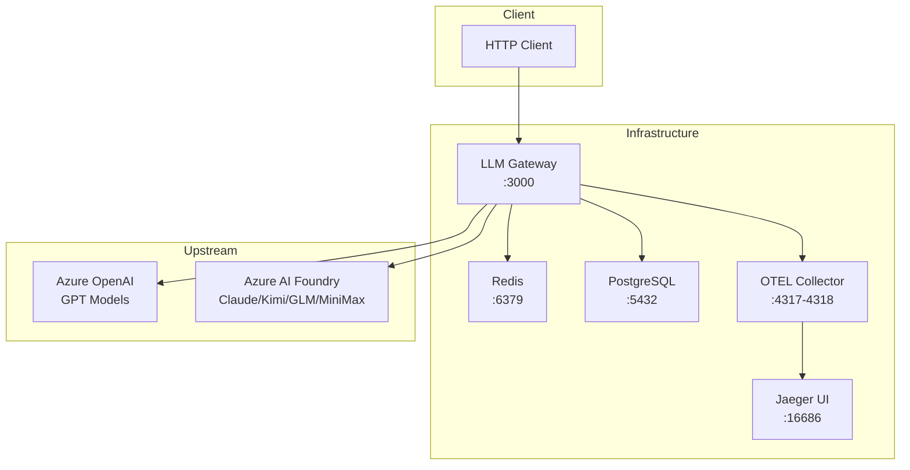
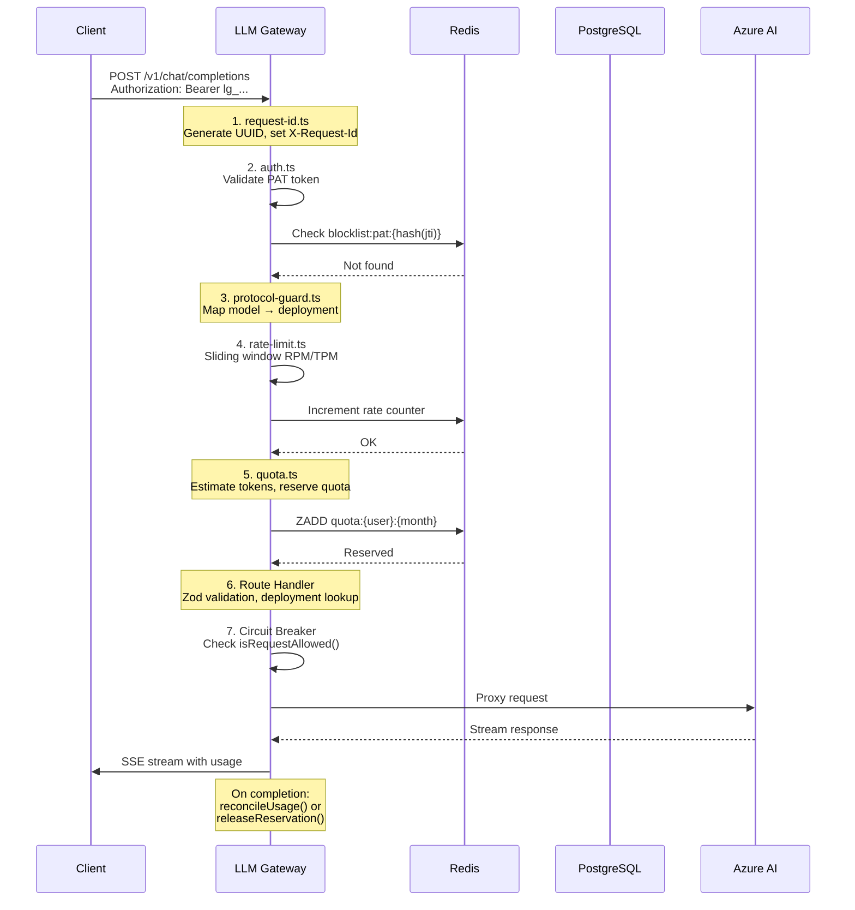
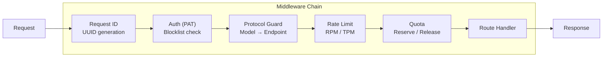
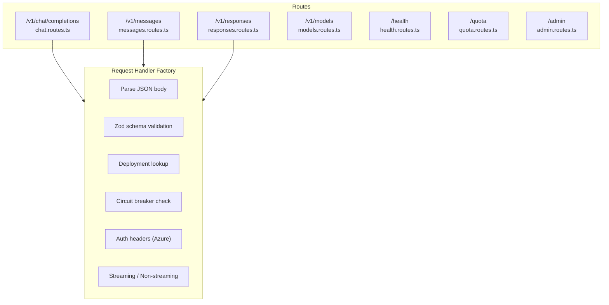
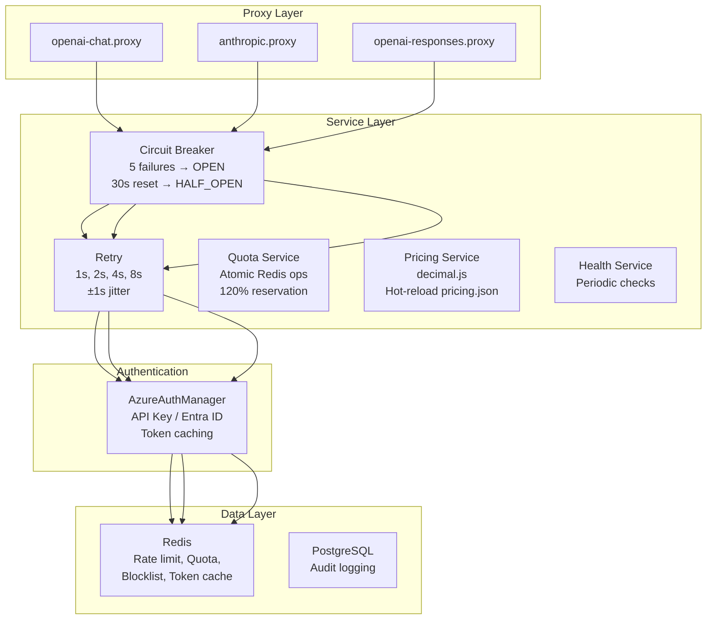
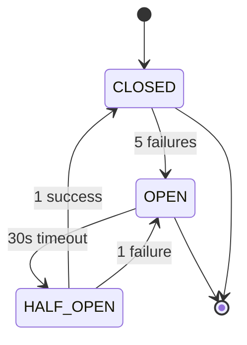
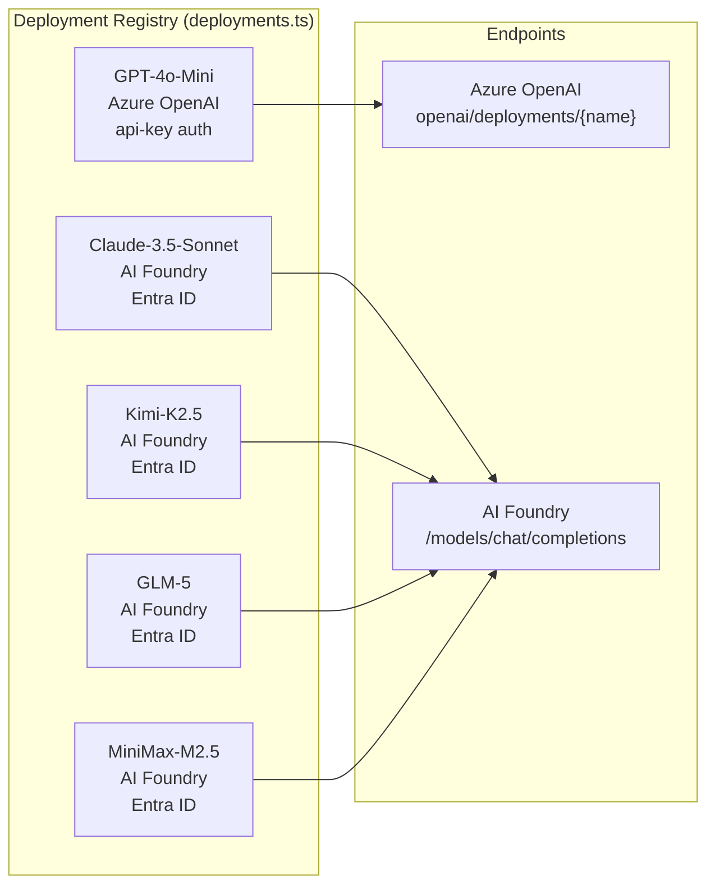
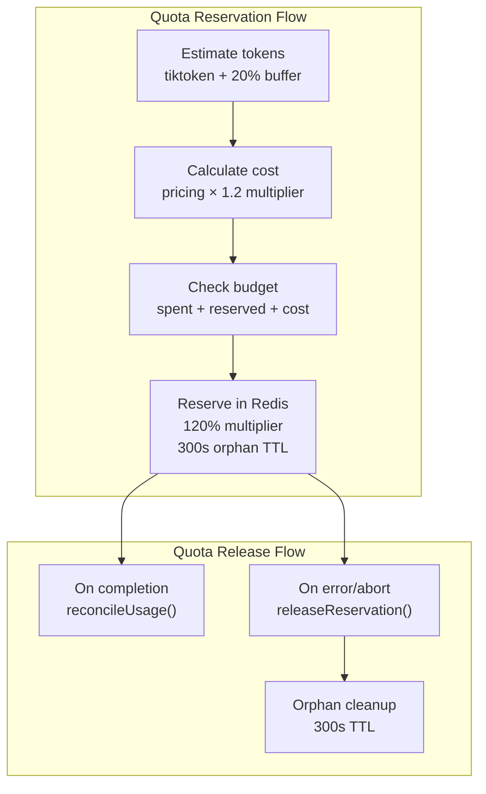
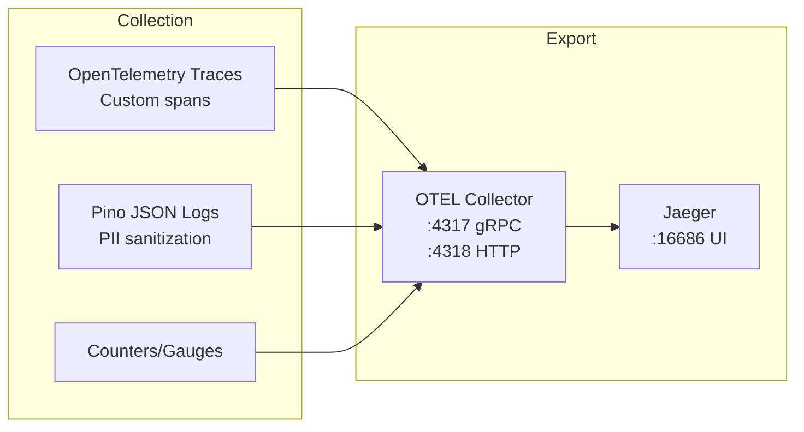

# LLM Gateway Architecture

An LLM API proxy server built in **Bun/Hono** that proxies requests to Azure OpenAI and Azure AI Foundry endpoints.

## Overview

```
┌─────────────────────────────────────────────────────────────────────────────────┐
│                              LLM Gateway                                        │
│                                                                                 │
│  ┌──────────┐   ┌──────────┐   ┌──────────┐   ┌──────────┐   ┌──────────┐ │
│  │ Request  │──▶│   Auth   │──▶│ Protocol │──▶│  Rate   │──▶│  Quota   │ │
│  │    ID   │   │   PAT    │   │  Guard   │   │  Limit   │   │          │ │
│  └──────────┘   └──────────┘   └──────────┘   └──────────┘   └──────────┘ │
│                                                                   │            │
│                                                                   ▼            │
│                                                    ┌─────────────────────────┐ │
│                                                    │   Request Handler       │ │
│                                                    │      Factory            │ │
│                                                    └─────────────────────────┘ │
│                                                                   │            │
│         ┌───────────────────────┬───────────────────────┬───────┘            │
│         ▼                       ▼                       ▼                      │
│  ┌──────────────┐      ┌──────────────┐      ┌──────────────┐                │
│  │    OpenAI    │      │  Anthropic   │      │  Responses   │                │
│  │    Chat      │      │  Messages    │      │     API      │                │
│  └──────┬───────┘      └──────┬───────┘      └──────┬───────┘                │
│         │                     │                     │                          │
│         ▼                     ▼                     ▼                          │
│  ┌─────────────────────────────────────────────────────────┐                  │
│  │              Proxy Layer (Retry + Circuit Breaker)       │                  │
│  └─────────────────────────────────────────────────────────┘                  │
│                              │                                                │
└──────────────────────────────┼────────────────────────────────────────────────┘
                               │
                               ▼
              ┌───────────────────────────────────────┐
              │        Azure OpenAI / AI Foundry       │
              └───────────────────────────────────────┘
```

## Infrastructure



## Request Flow



## Middleware Chain



### Middleware Details

| Middleware | File | Responsibility |
|------------|------|----------------|
| Request ID | `request-id.ts` | Generate UUID v4, set `X-Request-Id` header |
| Auth | `auth.ts` | Validate PAT `lg_{userId}_{header}.{payload}.{signature}`, check Redis blocklist |
| Protocol Guard | `protocol-guard.ts` | Validate model-endpoint compatibility |
| Rate Limit | `rate-limit.ts` | Sliding window via Redis sorted sets |
| Quota | `quota.ts` | Token estimation, 120% cost reservation, 429 on hard limit |

## Route Handlers



### Protocol Routing

| Route | Protocol | Models |
|-------|----------|--------|
| `/v1/chat/completions` | OpenAI Chat Completions | GPT-4o, GPT-4o-Mini, Kimi, GLM, MiniMax |
| `/v1/messages` | Anthropic Messages | Claude-3.5-Sonnet, Claude-3.7-Sonnet |
| `/v1/responses` | OpenAI Responses API | GPT-4o, GPT-4o-Mini |

## Service Architecture



## Circuit Breaker State Machine



## Deployment Registry



## Quota Management



## Observability



### Custom Trace Spans

| Span Attribute | Description |
|----------------|-------------|
| `llm.user_id` | PAT user identifier |
| `llm.model` | Model name |
| `llm.tokens.prompt` | Estimated prompt tokens |
| `llm.tokens.completion` | Estimated completion tokens |
| `llm.cost.usd` | Estimated cost in USD |

## File Structure

```
src/
├── config/
│   ├── env.ts           # Zod environment validation
│   ├── deployments.ts   # 8 model deployments
│   └── pricing.json     # Per-model pricing (hot-reload)
├── middleware/
│   ├── request-id.ts    # UUID generation
│   ├── auth.ts          # PAT authentication
│   ├── protocol-guard.ts # Model-endpoint validation
│   ├── rate-limit.ts    # Redis rate limiting
│   └── quota.ts         # Quota reservation
├── services/
│   ├── azure-auth.ts    # Entra ID + API Key auth
│   ├── circuit-breaker.ts
│   ├── retry.ts
│   ├── pricing.service.ts
│   ├── quota.service.ts
│   └── health.service.ts
├── proxy/
│   ├── openai-chat.proxy.ts
│   ├── anthropic.proxy.ts
│   └── openai-responses.proxy.ts
├── routes/
│   ├── chat.routes.ts
│   ├── messages.routes.ts
│   ├── responses.routes.ts
│   ├── models.routes.ts
│   ├── health.routes.ts
│   ├── quota.routes.ts
│   ├── admin.routes.ts
│   └── factories/       # Request handler factory
├── utils/
│   ├── errors.ts        # Protocol-aware errors
│   ├── tokens.ts        # Token estimation
│   ├── streaming.ts     # SSE parsing
│   ├── result.ts        # Result[T, E] type
│   └── functional.ts    # pipe/compose helpers
├── observability/
│   ├── tracing.ts       # OpenTelemetry
│   ├── logger.ts        # Pino structured logging
│   └── metrics.ts
├── db/
│   ├── migration.sql
│   └── data-access.ts
└── index.ts             # Hono app bootstrap
```

## Technology Stack

| Component | Technology |
|-----------|------------|
| Runtime | Bun |
| Framework | Hono |
| Validation | Zod |
| Rate Limit / Quota | Redis |
| Audit Log | PostgreSQL |
| Tracing | OpenTelemetry + Jaeger |
| Logging | Pino |
| Pricing | decimal.js |
| Token Estimation | tiktoken |
