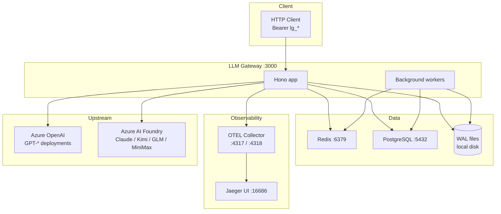
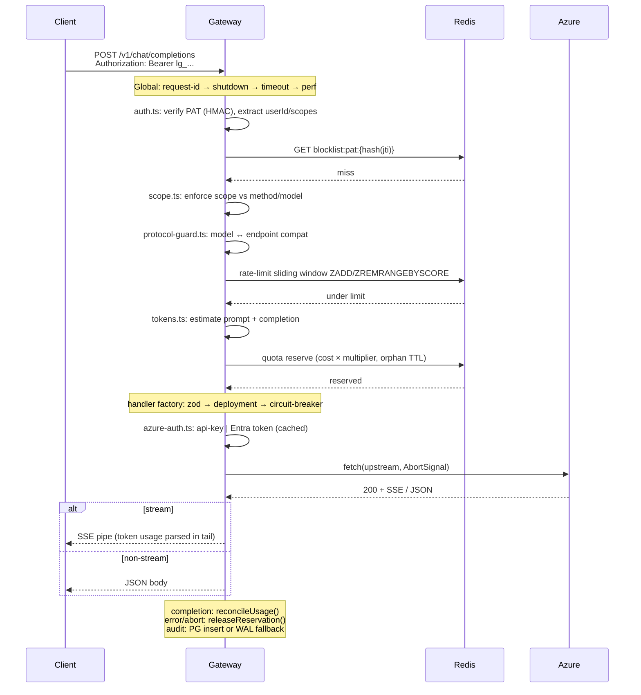
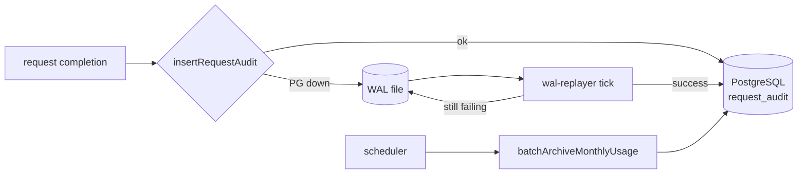
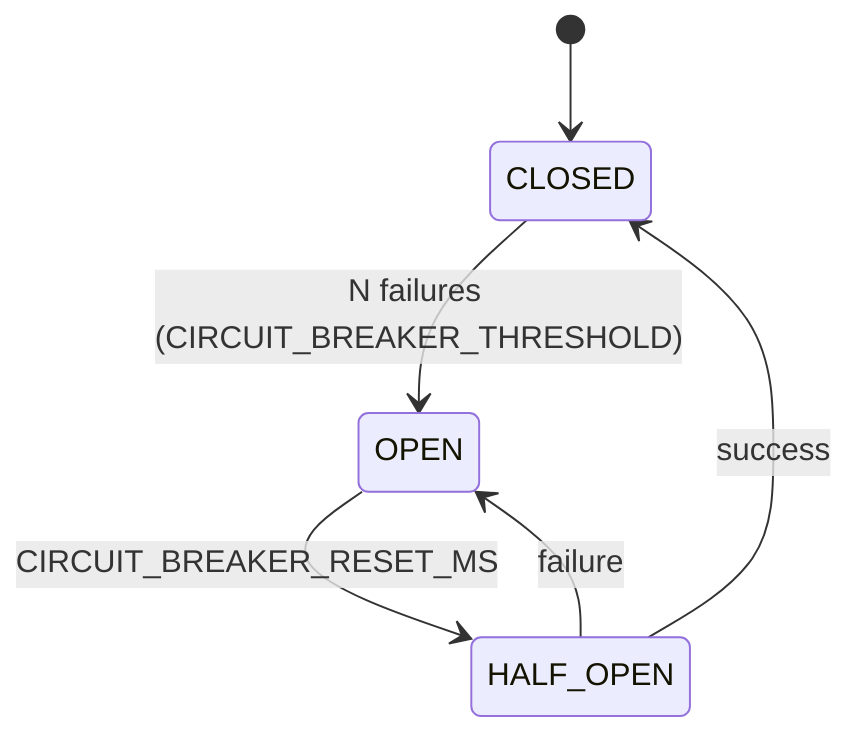
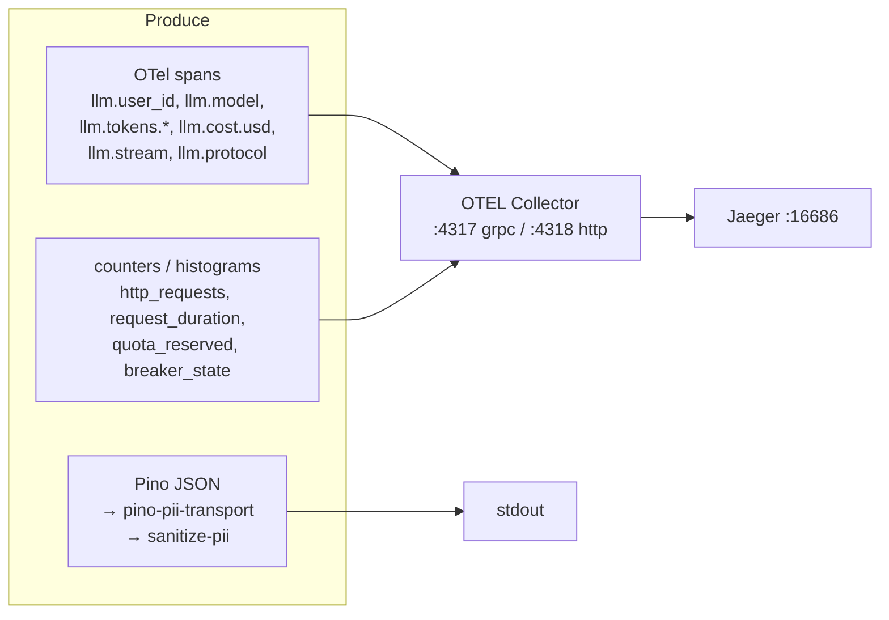

# LLM Gateway Architecture

LLM API proxy server built in **Bun/Hono**. Proxies to Azure OpenAI and Azure AI Foundry. Adds PAT auth, scope enforcement, rate-limit, quota reservation, circuit-breaker + retry, audit-log WAL, graceful shutdown, OTel tracing, Pino logs with PII sanitization, and Prometheus-style metrics.

## High-Level

```
                        ┌──────────── Clients ────────────┐
                        │  HTTP (Bearer PAT lg_*)          │
                        └──────────────┬───────────────────┘
                                       │
        ┌──────────────────────────────▼──────────────────────────────────┐
        │                    LLM Gateway (Bun.serve)                      │
        │                                                                 │
        │  ┌────────────── Global middleware (every route) ────────────┐  │
        │  │ compress → secureHeaders → cors → request-id →            │  │
        │  │ shutdown-tracker → timeout → performance/metrics          │  │
        │  └────────────────────────────────────────────────────────────┘ │
        │                                                                 │
        │  ┌────────────── Protected proxy chain (LLM routes) ─────────┐  │
        │  │ auth(PAT) → scope → protocol-guard → rate-limit → quota   │  │
        │  └─────────────────────────┬──────────────────────────────────┘ │
        │                            ▼                                    │
        │             ┌──── Request Handler Factory ────┐                 │
        │             │ parse → zod → deployment lookup │                 │
        │             │ → circuit-breaker → auth headers│                 │
        │             │ → stream | non-stream proxy     │                 │
        │             └────────────────┬────────────────┘                 │
        │                              ▼                                  │
        │     ┌────────────┬───────────────────┬────────────────┐         │
        │     │ openai-chat│ anthropic.messages│ openai-responses│        │
        │     │ .proxy     │  .proxy           │  .proxy + tools │        │
        │     └─────┬──────┴────────┬──────────┴────────┬───────┘         │
        │           │               │                   │                 │
        │  ┌────────▼───────────────▼───────────────────▼──────────┐      │
        │  │ retry (exp backoff + jitter) · azure-auth (key/Entra)│      │
        │  │ streaming utils · token estimator · pricing.decimal  │      │
        │  └────────────────────────┬──────────────────────────────┘      │
        │                           ▼                                     │
        │             ┌─────────── Operator surface ──────────┐           │
        │             │ /health  /quota  /v1/models  /admin   │           │
        │             │ (admin needs requireAdminScope +      │           │
        │             │  X-Operator-Secret HMAC)              │           │
        │             └────────────────────────────────────────┘          │
        │                                                                 │
        │  ┌──────── Background workers (start on boot) ──────┐           │
        │  │ scheduler (orphan-quota sweep, audit archive,    │           │
        │  │   monthly-spent reconcile)  ·  wal-replayer       │           │
        │  │ health-checks  ·  pricing-watcher (hot reload)    │           │
        │  └───────────────────────────────────────────────────┘          │
        └──────────┬──────────────────────────────────┬───────────────────┘
                   │                                  │
        ┌──────────▼─────────┐               ┌────────▼─────────────┐
        │  Redis             │               │  PostgreSQL          │
        │  rate / quota /    │               │  request_audit       │
        │  blocklist /       │               │  monthly archive     │
        │  response-cache /  │               │  PAT revocations     │
        │  azure-token cache │               └────────┬─────────────┘
        └────────────────────┘                        │
                                              ┌───────▼────────┐
                                              │  WAL on disk   │
                                              │ (dual-failure  │
                                              │  DLQ → replay) │
                                              └────────────────┘
                                       │
                          ┌────────────▼──────────────┐
                          │ Azure OpenAI (api-key)    │
                          │ Azure AI Foundry (Entra)  │
                          └───────────────────────────┘

      Observability sidecar:  OTEL Collector :4317/:4318  →  Jaeger :16686
      Logs:                   Pino JSON → stdout + PII-redacting transport
      Metrics:                in-process counters/histograms → OTLP HTTP
```

## Infrastructure



## Request Flow (LLM proxy route)



## Middleware Chain

```mermaid
flowchart LR
    subgraph Global["Global (app.ts)"]
        G1[compress]
        G2[secureHeaders]
        G3[cors]
        G4[request-id]
        G5[shutdown tracker]
        G6[timeout + AbortSignal]
        G7[performance / metrics]
    end

    subgraph Proxy["Proxy routes"]
        P1[auth - PAT]
        P2[scope]
        P3[protocol-guard]
        P4[rate-limit]
        P5[quota reserve]
        P6[handler factory]
    end

    Request --> G1 --> G2 --> G3 --> G4 --> G5 --> G6 --> G7 --> P1 --> P2 --> P3 --> P4 --> P5 --> P6 --> Response
```



| Layer | File | Responsibility |
|-------|------|----------------|
| compress | `hono-compress` | gzip/br, skips `text/event-stream` and `no-transform` |
| secureHeaders | `hono/secure-headers` | HSTS, X-Frame-Options DENY, nosniff, no-referrer |
| cors | `hono/cors` | `CORS_ALLOWED_ORIGINS` (required in prod) |
| request-id | `middleware/request-id.ts` | UUID v4, sets `X-Request-Id` |
| shutdown | `services/shutdown.service.ts` | in-flight counter + body-stream tracker, drain on SIGTERM |
| timeout | `middleware/timeout.ts` | request-scoped `AbortSignal`, cleanup on disconnect |
| performance | `middleware/performance.ts` | http counter + duration histogram |
| auth | `middleware/auth.ts` | PAT `lg_{userId}_{header}.{payload}.{sig}`, HMAC verify, Redis blocklist |
| scope | `middleware/scope.ts` | scopes: `admin` / `all` / `read` / `models:<name>` |
| admin-scope | `middleware/admin-scope.ts` | `admin` scope + `X-Operator-Secret` HMAC (with rotation) |
| protocol-guard | `middleware/protocol-guard.ts` | model ↔ route protocol compatibility |
| rate-limit | `middleware/rate-limit.ts` | Redis sorted-set sliding RPM/TPM |
| quota | `middleware/quota.ts` | estimate + reserve (`QUOTA_RESERVE_MULTIPLIER`), orphan TTL |
| cache | `middleware/cache.ts` | Redis response-cache (only `/v1/models`) keyed by user+scopes |

## Routes & Mounted Middleware

```mermaid
flowchart TD
    subgraph LLM_Proxy[LLM proxy chains]
        CHAT["/v1/chat/completions<br/>chat.routes.ts<br/>auth · scope · protocol-guard · rate · quota"]
        MSG["/v1/messages<br/>messages.routes.ts<br/>same chain"]
        RESP["/v1/responses<br/>responses.routes.ts<br/>same chain + responses-tools"]
    end
    subgraph Operator[Operator surface]
        MODELS["/v1/models<br/>auth · scope · cache(60s)"]
        QUOTA["/quota<br/>auth · scope"]
        HEALTH["/health<br/>cached deployment health"]
        ADMIN["/admin<br/>auth · requireAdminScope (HMAC)"]
    end

    CHAT --> Factory
    MSG --> Factory
    RESP --> Factory

    subgraph Factory[request-handler.factory.ts]
        F1[parse JSON]
        F2[Zod validate]
        F3[deployment lookup]
        F4[circuit-breaker.isRequestAllowed]
        F5[azure-auth headers]
        F6[stream | non-stream proxy]
    end
```

| Route | Protocol | Models |
|-------|----------|--------|
| `/v1/chat/completions` | OpenAI Chat | GPT-4o, GPT-4o-Mini, Kimi, GLM, MiniMax |
| `/v1/messages` | Anthropic Messages | Claude-3.5/3.7 Sonnet |
| `/v1/responses` | OpenAI Responses (+ tools) | GPT-4o, GPT-4o-Mini |
| `/v1/models` | catalog | all |
| `/quota` | report | n/a |
| `/health` | liveness + readiness | n/a |
| `/admin` | PAT revoke, ops | n/a |

## Services

```mermaid
graph TB
    subgraph Proxy
        OA[openai-chat.proxy]
        AN[anthropic.proxy]
        OR[openai-responses.proxy]
        SH[proxy/shared.ts]
        RT[responses-tools.ts]
    end

    subgraph Reliability
        CB[circuit-breaker<br/>CLOSED→OPEN→HALF_OPEN]
        RTRY[retry<br/>exp backoff + jitter]
        AZ[azure-auth<br/>key | Entra<br/>token cache]
    end

    subgraph Stateful[Stateful services]
        QS[quota.service<br/>+ quota/ factories]
        PS[pricing.service<br/>decimal.js + watcher]
        HS[health.service<br/>cached deployment health]
        SS[shutdown.service]
    end

    subgraph BgWorkers[Background workers]
        SCHED[scheduler.service<br/>orphan sweep · audit archive ·<br/>monthly-spent reconcile · locks]
        WAL[wal.service<br/>append/read/remove]
        WALR[wal-replayer.service<br/>drain WAL → PG]
    end

    OA --> SH --> CB --> RTRY --> AZ
    AN --> SH
    OR --> SH
    OR --> RT
    QS --> Redis[(Redis)]
    PS --> File[(pricing.json)]
    HS --> Redis
    SCHED --> Redis
    SCHED --> PG[(PostgreSQL)]
    WALR --> WAL
    WALR --> PG
```

## Audit & WAL



## Circuit Breaker



## Quota

```mermaid
flowchart TB
    EST[tokens.ts<br/>tiktoken + safety buffer] --> COST[pricing × multiplier]
    COST --> CHECK[spent + reserved + cost ≤ budget?]
    CHECK -- no --> H429[429 quota_exceeded]
    CHECK -- yes --> RES[Redis ZADD quota:{user}:{month}<br/>orphan TTL]
    RES --> DONE[reconcileUsage on stream end]
    RES --> ERR[releaseReservation on error/abort]
    SCHED2[scheduler.cleanupOrphanedReservations] --> RES
```

Multiplier comes from `QUOTA_RESERVE_MULTIPLIER` env (was hardcoded 1.2; now configurable).

## Observability



`otlp-http-url.ts` normalizes the OTLP HTTP endpoint; `pino-pii-transport.ts` runs each log through `sanitize-pii.ts` before write.

## File Structure

```
src/
├── app.ts                          # Hono bootstrap, global middleware, error handler
├── index.ts                        # Bun.serve, worker lifecycle, graceful shutdown
├── types.ts
├── config/
│   ├── env.ts                      # Zod env validation
│   ├── deployments.ts              # deployment registry
│   ├── pricing.json                # per-model pricing (hot reload)
│   └── index.ts
├── middleware/
│   ├── request-id.ts
│   ├── auth.ts                     # PAT verify + Redis blocklist
│   ├── scope.ts                    # scope enforcement
│   ├── admin-scope.ts              # operator HMAC secret
│   ├── protocol-guard.ts
│   ├── rate-limit.ts               # Redis sliding window
│   ├── quota.ts                    # reservation gate
│   ├── cache.ts                    # response cache (models)
│   ├── timeout.ts                  # AbortSignal lifecycle
│   └── performance.ts              # http metrics
├── proxy/
│   ├── shared.ts                   # streaming + reservation glue
│   ├── openai-chat.proxy.ts
│   ├── anthropic.proxy.ts
│   ├── openai-responses.proxy.ts
│   └── responses-tools.ts
├── routes/
│   ├── chat.routes.ts
│   ├── messages.routes.ts
│   ├── responses.routes.ts
│   ├── models.routes.ts
│   ├── health.routes.ts
│   ├── quota.routes.ts
│   ├── admin.routes.ts
│   └── factories/request-handler.factory.ts
├── services/
│   ├── azure-auth.ts               # API key | Entra ID + cache
│   ├── circuit-breaker.ts
│   ├── retry.ts
│   ├── pricing.service.ts          # decimal.js + file watcher
│   ├── quota.service.ts
│   ├── quota/                      # quota factories + constants
│   ├── health.service.ts           # periodic upstream probes (cached)
│   ├── scheduler.service.ts        # orphan sweep, archive, reconcile
│   ├── shutdown.service.ts         # drain + body-stream tracking
│   ├── wal.service.ts              # disk DLQ
│   └── wal-replayer.service.ts     # drain WAL → PG
├── db/
│   ├── client.ts                   # Postgres pool
│   ├── data-access.ts              # audit + monthly + revocation queries
│   └── redis.ts
├── observability/
│   ├── tracing.ts                  # OTel SDK + spans
│   ├── logger.ts                   # Pino root
│   ├── pino-pii-transport.ts
│   ├── sanitize-pii.ts
│   ├── metrics.ts                  # counters + histograms
│   └── otlp-http-url.ts
└── utils/
    ├── errors.ts                   # protocol-aware error bodies
    ├── tokens.ts                   # tiktoken estimation
    ├── streaming.ts                # SSE parse + reconcile
    ├── auth.ts                     # PAT primitives
    ├── model-scope.ts              # scope ↔ model matcher
    ├── fetch.ts                    # fetch wrapper
    ├── mutex.ts
    ├── result.ts                   # Result<T,E>
    └── functional.ts               # pipe/compose
```

## Background Workers (start in `index.ts`)

| Worker | Purpose |
|--------|---------|
| `startHealthChecks` | periodic deployment probes; result cached for `/health` |
| `startBackgroundJobs` (scheduler) | orphan-reservation sweep, monthly archive, spent reconcile (Redis lock) |
| `startWalReplayer` | drain WAL DLQ into PG audit table |
| `startPricingWatcher` | reload `pricing.json` on change |

Shutdown order on SIGTERM/SIGINT (`index.ts`):
stop health → stop scheduler → stop WAL replayer → stop pricing watcher → `Bun.serve.stop(false)` → drain in-flight (shutdown.service) → shutdown metrics → shutdown tracing → close Redis → close Postgres → flush Pino → `exit(0)`.

## Technology Stack

| Component | Technology |
|-----------|------------|
| Runtime | Bun |
| Framework | Hono |
| Validation | Zod |
| Rate-limit / Quota / Cache | Redis |
| Audit / Archive | PostgreSQL + on-disk WAL fallback |
| Tracing | OpenTelemetry → Jaeger |
| Logging | Pino + PII-redacting transport |
| Metrics | OTel SDK counters/histograms |
| Pricing | decimal.js |
| Tokens | tiktoken |
| Auth (upstream) | Azure API key / Microsoft Entra ID (token cache) |
| Auth (inbound) | PAT (HMAC) + scopes + operator HMAC secret |
